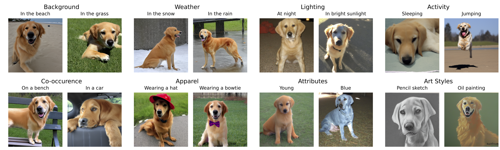

# Dataset Interfaces

This repository contains the code for our recent work:

**Dataset Interfaces: Diagnosing Model Failures Using Controllable Counterfactual Generation** <br>
*Joshua Vendrow\*, Saachi Jain\*, Logan Engstrom, Aleksander Madry* <br>
Paper: [https://arxiv.org/abs/2302.07865](https://arxiv.org/abs/2302.07865) <br>
Blog post: [https://gradientscience.org/dataset-interfaces/](https://gradientscience.org/dataset-interfaces/)

<p>

</p>

## Getting started
Install using pip, or clone our repository.
```
pip install dataset-interfaces
```

**Example:** For a walkthrough of codebase, check out our [example notebook](notebooks/Example.ipynb). This notebook shows how to
construct a dataset interface for a subset of ImageNet and generate counterfactual examples. 

Before running `run_textual_inverson`, initialize an [🤗Accelerate](https://github.com/huggingface/accelerate/) environment with:

```bash
accelerate config
```

## Constructing a Dataset Interface
Constructing a dataset interface consists or learning a *class token* for each class in a datset, which can then be included in textual prompts. 

To learn a single token, we use the following function:
```python
from dataset_interfaces import run_textual_inversion

embed = run_textual_inversion (
    train_path=train_path,  # path to directory with training set for a single class
    token=token,            # text to use for new token, e.g "<plate>"
    class_name=class_name,  # natrual language class description, e.g., "plate"
)
```

Once all the class tokens are learned, we can create a custom tokenizer and text encoder with these tokens:

```python
import inference_utils as infer_utils

infer_utils.create_encoder (
    embeds=embeds,             # list of learned embeddings (from the code block above)
    tokens=tokens,             # list of token strings
    class_names=class_names,   # list of natural language class descriptions
    encoder_root=encoder_root  # path where to store the tokenizer and encoder
)
```

## Generating Counterfactual Examples

We can now generate counterfactual examples by incorporating our learned tokens in textual prompts. The ``generate`` function generates images for a specific class in the dataset (indexed in the order that classes are passed when constructing the encoder). When specifying the text prompt, "<TOKEN>" acts as a placeholder for the class token.
```python
from dataset_interfaces import generate

generate (
    encoder_root=encoder_root,
    c=c,                                          # index of a specific class
    prompts="a photo of a <TOKEN> in the grass",  # can be a single prompt or a list of prompts
    num_samples=10, 
    random_seed=0                                 # no seed by default
)
```

## CLIP Metric

To directly evaluate the quality of the generated image, we use *CLIP similarity* to quantify the presence of the object of interest and desired distribution shift in the image.

We can measure CLIP similarity between a set of generated images and a given caption as follows:

```
sim_class = infer_utils.clip_similarity(imgs, "a photo of a dog")
sim_shift = infer_utils.clip_similarity(imgs, "a photo in the grass")
```


## ImageNet* Benchmark
Our benchmark for the ImageNet dataset consists of two components: our 1,000 learned class tokens for ImageNet, and the images generated by these tokens in 23 distribution shifts. 

### ImageNet* Tokens

The 1,000 learned tokens are avaiable on [HuggingFace](https://huggingface.co/datasets/madrylab/imagenet-star-tokens) and can be downloaded with:
```
wget https://huggingface.co/datasets/madrylab/imagenet-star-tokens/resolve/main/tokens.zip
```
To generate images with these tokens, we first create a text encoder with the tokens, which we use to seamlessly integrate the tokens in text prompts:

```python
token_path = "./tokens". # path to the tokens from HuggingFace
infer_utils.create_imagenet_star_encoder(token_path, encoder_root="./encoder_root_imagenet")
```
Now, we can generate counterfactual examples of ImageNet from a textual prompt (See the [example notebook](notebooks/Example.ipynb) for a walk-through):
```python
from dataset_interfaces import generate

encoder_root = "./encoder_root_imagenet"
c = 207  # the class for golden retriever
prompt = "a photo of a <TOKEN> wearing a hat"
generate(encoder_root, c, prompt, num_samples=10)
```

### ImageNet* Images
Our benchmark contains images in 23 distribution shifts, with 50k images per shift (50 per class for 1000 classes). These images are also available on [HuggingFace](https://huggingface.co/datasets/madrylab/imagenet-star). In this repo we also provide masks for each distribution shift indicating which images we filter out with our CLIP metrics, at `masks.npy`.

We provide a wrapper on top `torchvision.datasets.ImageFolder` to construct a dataset object that filters the images o=un the benchmark using this mask. So, we can make a dataset object for a shift as follows:

```python
from dataset_interfaces import utils

root = "./imagenet-star"     # the path where the dataset from HuggingFace
mask_path = "./masks.npy"    # the path to the mask file
shift = "in_the_snow"        # the distribution shift of interest

ds = utils.ImageNet_Star_Dataset(
    root, 
    shift=shift,
    mask_path=mask_path
)
```

## Citation
To cite this paper, please use the following BibTex entry:
```
@inproceedings{vendrow2023dataset,
   title = {Dataset Interfaces: Diagnosing Model Failures Using Controllable Counterfactual Generation},
   author = {Joshua Vendrow and Saachi Jain and Logan Engstrom and Aleksander Madry}, 
   booktitle = {ArXiv preprint arXiv:2302.07865},
   year = {2023}
}
```

## Maintainers:
[Josh Vendrow](https://twitter.com/josh_vendrow)<br>
[Saachi Jain](https://twitter.com/saachi_jain_)
